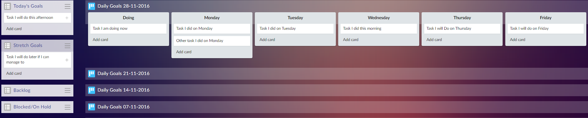

# Favrobot

## My way of organising myself

Keeping track of tasks, prioritising and scheduling effectively is a big challenge. 

People are quite different and need different things in a task tracker, I value being able to schedule in tasks for later, having a record of what tasks got done when and being able to sort through the days tasks at the start.

That is why after lots of tweaking I have settled on my very own way I use [favro](https://favro.com) which is basically Trello++ (it is worth checking out). I have a board for each week of work, and at the start of each day I set myself goals and stretch goals for that day as well as any scheduled tasks I might have. I then do one at a time, using the [pomodoro](http://cirillocompany.de/pages/pomodoro-technique/) technique where practical. The current task sits in the Doing column then when it is done it moves into the column for the day. 

This app simply creates a new board with my 6 columns and the correct name (Daily Goals + date 7 days after most recent board).

## My way of trying out new stuff

This is also partly just a place for me to have an excuse to try out various things. Python and VS Code have proved to be a pretty nice pairing. 

Mutation testing was an interesting one to add (after [recommendation from uncle bob](http://blog.cleancoder.com/uncle-bob/2016/06/10/MutationTesting.html)). As well as running tests on commit with app veyor.

## My way of giving a little back, maybe

I don't expect anyone will have excatly the same task management needs that I do, but if anyone wanted to use anything here I have included an MIT license so go ahead!